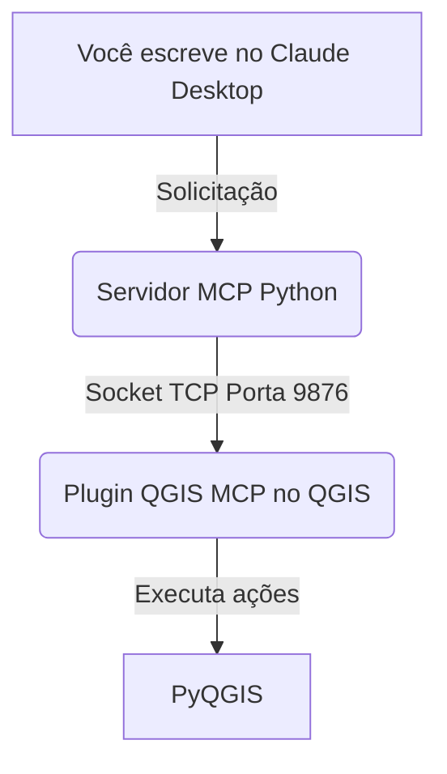

<div align="center">

# QGIS MCP — Guia Geral de Instalação
**Model Context Protocol para QGIS e Claude AI**

[](https://qgis.org)
[](https://python.org)
[](https://claude.ai)

</div>

---

## 📍 O que é o QGIS MCP?

**QGIS MCP** conecta o Claude AI ao QGIS Desktop por meio do **Model Context Protocol (MCP)**. Permite que o Claude controle o QGIS diretamente via linguagem natural para:
- Carregar e gerenciar camadas (vetoriais e raster).
- Executar algoritmos de processamento.
- Aplicar simbologia.
- Renderizar mapas.
- Executar código PyQGIS.

### ⚙️ Arquitetura da Conexão



> **⚠️ IMPORTANTE:** O fluxo principal funciona com o **Claude Desktop** (aplicativo instalado).

---

## 📋 Pré-requisitos

- **Sistema Operacional:** Windows 10/11
- **QGIS:** Versão 3.28 ou superior (testado na 3.44)
- **Claude:** [Claude Desktop](https://claude.ai/download) instalado
- **Controle de versão:** Git instalado
- **Python:** 3.12 ou superior (geralmente incluído no QGIS/OSGeo4W)

---

## 🚀 Instalação Passo a Passo

### PASSO 1 — Instalar o gerenciador de pacotes `uv`

Abra o **PowerShell** e execute o seguinte comando para instalar o `uv`:

```powershell
powershell -ExecutionPolicy ByPass -c "irm https://astral.sh/uv/install.ps1 | iex"
```

Feche e reabra o PowerShell. Adicione `uv` ao PATH permanentemente:

```powershell
[System.Environment]::SetEnvironmentVariable("Path", "C:\Users\lferrer\.local\bin;" + [System.Environment]::GetEnvironmentVariable("Path", "User"), "User")
```

Verifique a instalação *(Deve exibir `uv 0.11.x` ou superior)*:
```powershell
uv --version
```

### PASSO 2 — Clonar o repositório QGIS MCP

```powershell
git clone https://github.com/nkarasiak/qgis-mcp.git C:\qgis-mcp
```

### PASSO 3 — Preparar o pacote Python

Entre no diretório clonado:
```powershell
cd C:\qgis-mcp
```

Reescreva o arquivo `pyproject.toml` (certifique-se de incluir `package = true` para que o `uv` instale o entry point). Você pode executar este script no PowerShell:

```powershell
$toml = @"
[project]
name = "qgis-mcp"
version = "0.2.1"
description = "QGIS integration through the Model Context Protocol"
readme = "README.md"
requires-python = ">=3.12"
dependencies = [
    "mcp[cli]>=1.20.0",
]

[project.scripts]
qgis-mcp-server = "qgis_mcp.server:main"

[project.optional-dependencies]
dev = ["pytest>=7.0", "pytest-asyncio>=0.23"]

[tool.uv]
package = true

[tool.ruff]
target-version = "py312"
line-length = 100

[tool.ruff.lint]
select = ["E", "F", "W", "I", "UP", "B", "SIM", "RUF"]
ignore = ["E501"]

[tool.pytest.ini_options]
asyncio_mode = "auto"
"@
[System.IO.File]::WriteAllText("C:\qgis-mcp\pyproject.toml", $toml, [System.Text.UTF8Encoding]::new($false))
```

Instale as dependências e verifique o servidor:
```powershell
C:\Users\lferrer\.local\bin\uv.exe sync
C:\Users\lferrer\.local\bin\uv.exe run qgis-mcp-server
```
*(Deve exibir uma mensagem indicando que o servidor está iniciando e aguardará conexão na porta 9876. Use `Ctrl+C` para pará-lo).*

### PASSO 4 — Instalar o plugin no QGIS

Copie o plugin para o diretório de perfis do QGIS:
```powershell
Copy-Item -Recurse "C:\qgis-mcp\qgis_mcp_plugin" "C:\Users\lferrer\AppData\Roaming\QGIS\QGIS3\profiles\default\python\plugins\qgis_mcp_plugin"
```

Em seguida, dentro do QGIS:
1. Vá a **Complementos → Gerenciar e instalar complementos**.
2. Na aba **"Instalados"**, procure **QGIS MCP** e marque a caixa ✅.
3. Aparecerá um botão MCP *(ícone de corrente verde)* na barra de ferramentas.
4. Clique no botão → Porta `9876` → Marque **Auto-start on startup** ✅ (para iniciar automaticamente).

### PASSO 5 — Configurar o Claude Desktop

Crie o arquivo de configuração **sem BOM** (crítico no Windows para evitar erros no Claude):

```powershell
New-Item -ItemType Directory -Force "C:\Users\lferrer\AppData\Roaming\Claude"

$json = @"
{
  "mcpServers": {
    "qgis": {
      "command": "C:/Users/lferrer/.local/bin/uv.exe",
      "args": [
        "run",
        "--directory",
        "C:/qgis-mcp",
        "qgis-mcp-server"
      ]
    }
  }
}
"@
[System.IO.File]::WriteAllText("C:\Users\lferrer\AppData\Roaming\Claude\claude_desktop_config.json", $json, [System.Text.UTF8Encoding]::new($false))
```

### PASSO 6 — Verificar a conexão

1. Abra o QGIS (o plugin iniciará o servidor na porta 9876).
2. Feche completamente o Claude Desktop (se estiver aberto): `taskkill /F /IM "Claude.exe"`.
3. Abra o Claude Desktop.
4. Vá a **Configurações → Desenvolvedor**. O servidor `qgis` deve aparecer com status **running** 🟢.
5. No chat do Claude, teste escrevendo:
   > *"Ping QGIS to check connection, then tell me the QGIS version installed"*

---

## 🛠️ Ferramentas Disponíveis

O protocolo MCP habilita até **51 ferramentas**. As principais incluem:

| Ferramenta | Descrição |
|---|---|
| `ping` | Verificar conexão com o QGIS |
| `get_qgis_info` | Versão do QGIS, plugins instalados |
| `create_new_project` | Criar novo projeto .qgz |
| `load_project` | Abrir projeto existente |
| `get_project_info` | Informações do projeto ativo |
| `add_vector_layer` | Carregar camada vetorial (SHP, GPKG, etc.) |
| `add_raster_layer` | Carregar camada raster (TIF, etc.) |
| `get_layers` | Listar todas as camadas do projeto |
| `remove_layer` | Remover camada por ID |
| `zoom_to_layer` | Zoom para a extensão de uma camada |
| `get_layer_features` | Extrair feições de uma camada vetorial |
| `execute_processing` | Executar algoritmos do Processador |
| `save_project` | Salvar o projeto |
| `render_map` | Exportar o mapa como imagem PNG |
| `execute_code` | ⚠️ Executar código PyQGIS arbitrário |

---

## 🆘 Solução de Problemas

| Problema | Causa | Solução |
| --- | --- | --- |
| **Erro: `is not valid JSON` no Claude** | O PowerShell salvou o JSON com BOM (marca invisível). | Usar `[System.Text.UTF8Encoding]::new($false)` ao gravar o arquivo pelo PowerShell. |
| **Servidor como `failed` no Claude** | Claude não encontra `uv.exe` ou o diretório. | Usar caminhos absolutos no arquivo de config e reiniciar o Claude (`taskkill /F /IM "Claude.exe"`). |
| **`ModuleNotFoundError: No module named 'qgis_mcp'`** | Pacote não instalado no ambiente virtual. | Adicionar `package = true` em `[tool.uv]` do `pyproject.toml` e rodar `uv sync`. |
| **Plugin não aparece no QGIS** | Pasta em local incorreto. | Verificar se está no caminho correto em `AppData\Roaming\QGIS\QGIS3\profiles\default\python\plugins\`. |
| **`execute_code` retorna erro** | Erro de sintaxe no PyQGIS ou referência incorreta. | Testar o código no console Python do QGIS antes de enviá-lo via MCP. |

---

## 🛡️ Avisos de Segurança

- ⚠️ A ferramenta `execute_code` permite executar **qualquer código Python** na sua máquina. Use com extrema cautela.
- ⚠️ Não use o MCP em projetos com dados confidenciais se isso violar as políticas de uso de IA da sua organização.
- ⚠️ Mantenha o servidor MCP ativo somente quando necessário. Você pode desativar o **Auto-start** do plugin se preferir um início manual.

---

## 🔗 Referências Úteis

- [Repositório principal do QGIS MCP](https://github.com/nkarasiak/qgis-mcp)
- [Plugin no QGIS.org](https://plugins.qgis.org/plugins/qgis_mcp_plugin/)
- [Documentação MCP da Anthropic](https://docs.anthropic.com/en/docs/agents-and-tools/mcp)
- [Repositório original (jjsantos01)](https://github.com/jjsantos01/qgis_mcp)
- Comunidades: [QGIS Oficial](https://qgis.org/) | [QGIS Perú](https://qgis.pe/) | [QGIS España](https://www.qgis.es/) | [QGIS Brasil](https://qgisbrasil.org/)

---
*Guia desenvolvido por Lucho Ferrer (Associação QGIS Peru / Espanha) | El Laboratorio de Lucho.*
